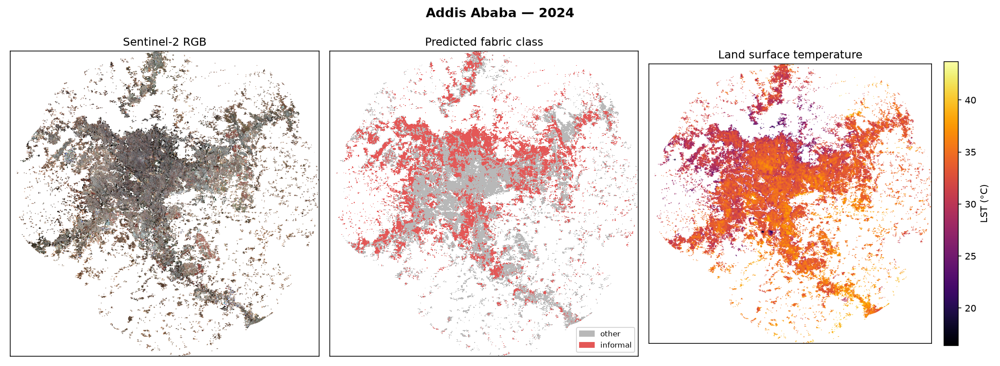
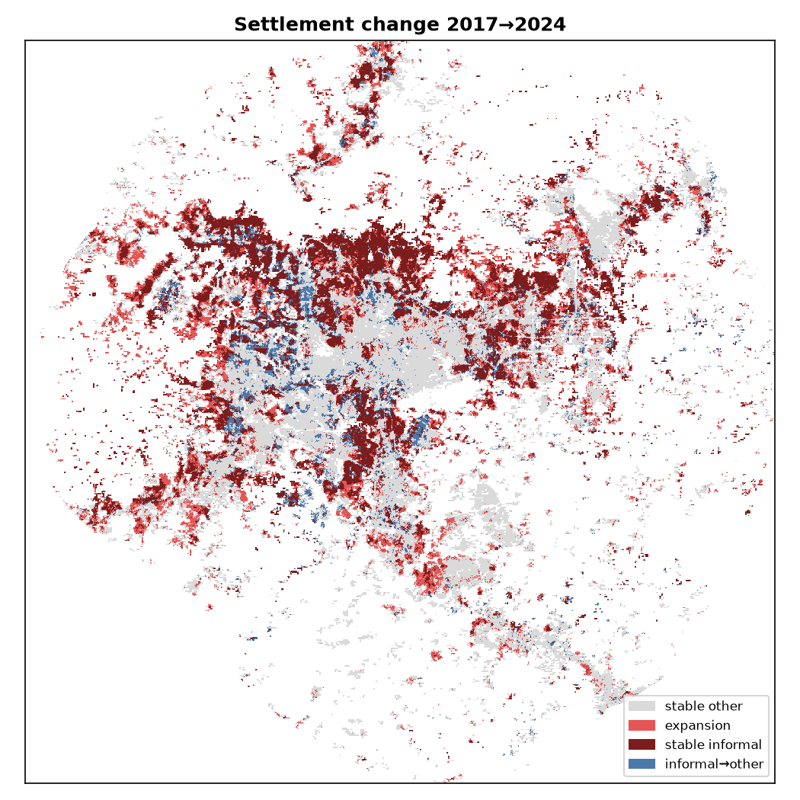
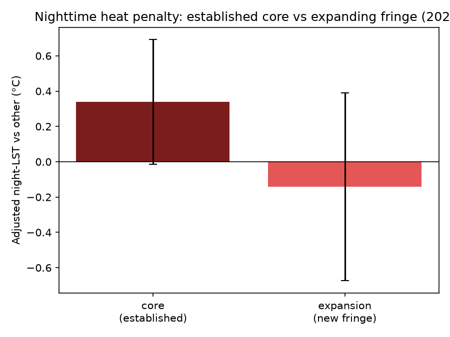

# Thermal Inequity Mapping — Addis Ababa

**Mapping Addis Ababa's informal settlements with a satellite AI foundation model, and finding out an urban heat penalty that is invisible by day but real at night (2017–2024).**

**[Read the paper (PDF)](_1_5em.pdf)** · [LaTeX source](paper/main.tex) 


<sub>For 2024 — left: Sentinel-2 true colour · centre: predicted fabric class (red = informal, grey = other) · right: daytime land-surface temperature.</sub>

---

## TL;DR

I used **Google's AlphaEarth** satellite embeddings (a foundation model that turns every 10 m patch of Earth into 64 numbers) plus ~70 hand-drawn labels and a simple linear classifier to map informal settlements — no hand-crafted spectral indices.

- **Classifier works:** informal vs formal fabric at **93.8% cross-validated AUC**.
- **Watched the city grow:** train once on 2024, apply to 2017 & 2024 → informal prevalence **31% → 42%**, with **18%** of the built city flagged as new growth at the fringe.
- **Twist:** by **day**, informal fabric is *not* hotter — it's slightly **cooler** (−0.4 °C), even after controlling for elevation and greenery.
- **Twist on the twist:** at **night** the sign flips — informal fabric runs up to **~1 °C hotter**, concentrated in the established dense core.
- **Lesson:** *whether you detect urban-heat inequity depends on the time of day you measure it.* Daytime surface temperature hides a penalty that is plainly there at night.

## The key result


<sub>Bars below zero = informal **cooler**; above zero = informal **hotter**. Daytime Landsat and MODIS agree informal is cooler — but the *same* MODIS sensor flips positive at **night** in 2017. Same instrument, day vs night, so it isn't a sensor artifact.</sub>

And it's the **established core**, not the newly-expanded fringe, that traps heat overnight — the city is growing into its own heat problem:

<p align="center">
  
  
</p>
<sub>Left: settlement change 2017→2024 (red = new informal growth). Right: the 2024 nighttime heat gap — the established core trends hotter (+0.34 °C), the new fringe shows nothing.</sub>

## How it works

1. **Export** AlphaEarth embeddings + Landsat/MODIS temperature + Sentinel-2 NDVI/RGB + elevation from Google Earth Engine, clipped to Addis's built-up area (admin boundary + 10 km, masked to built-up land).
2. **Label** ~70 informal/other polygons in QGIS over 2024 imagery.
3. **Classify** each pixel from its 64-number embedding (linear probe beats MLP and XGBoost — a known trait of these embeddings).
4. **Train once, apply twice** to 2017 & 2024 so any change reflects the ground, not label drift; build the settlement-expansion map.
5. **Compare temperatures** by class with confounder-adjusted regression — first daytime (Landsat), then the **nighttime extension** (MODIS), with purity-restricted and core-vs-fringe tests.

## Pipeline

| Step | Script | What it does |
|---|---|---|
| 1 | [`01_export_ee_layers.py`](scripts/01_export_ee_layers.py) | Export all layers from Earth Engine (incl. `--layers modis_night modis_day`) |
| 2 | [`02_make_label_project.py`](scripts/02_make_label_project.py) | Build the QGIS labeling GeoPackage + hotspot guide |
| 3 | [`03_sample_points.py`](scripts/03_sample_points.py) | Sample pixels per polygon; polygon-grouped split |
| 4 | [`04_train_classifier.py`](scripts/04_train_classifier.py) | Train logreg / MLP / XGBoost; grouped-CV; pick primary |
| 5 | [`05_apply_and_change.py`](scripts/05_apply_and_change.py) | Apply frozen model to both years; change map |
| 6 | [`06_statistics.py`](scripts/06_statistics.py) | Daytime LST stats: Mann–Whitney, adjusted OLS, trend |
| 7 | [`07_visualize.py`](scripts/07_visualize.py) | RGB / class / LST panels, change overlay |
| 8 | [`08_check_labels.py`](scripts/08_check_labels.py) | Label QA (counts, balance, validity, overlaps) |
| 9 | [`09_nighttime_analysis.py`](scripts/09_nighttime_analysis.py) | **Extension:** MODIS day/night effect + purity test |
| 10 | [`10_core_vs_fringe.py`](scripts/10_core_vs_fringe.py) | **Extension:** core vs fringe nighttime penalty |

## Setup & run

```bash
pip install -r requirements.txt

# 1. Export satellite layers (needs a Google Earth Engine account + GCP project)
python scripts/01_export_ee_layers.py --project YOUR_GCP_PROJECT_ID
python scripts/01_export_ee_layers.py --project YOUR_GCP_PROJECT_ID --layers modis_night modis_day

# 2. Create the labeling project, then digitize polygons in QGIS
python scripts/02_make_label_project.py

# 3–10. Analysis
python scripts/03_sample_points.py
python scripts/04_train_classifier.py
python scripts/05_apply_and_change.py
python scripts/06_statistics.py
python scripts/07_visualize.py
python scripts/09_nighttime_analysis.py
python scripts/10_core_vs_fringe.py
```

## Data note

The raw GeoTIFF exports (the 64-band embeddings alone are ~1 GB each) are **not** committed — they are fully reproducible by running `scripts/01`. The hand-drawn labels ([`data/labels/`](data/labels)), trained models, results, and figures **are** included.

## Repo layout

```
scripts/     # 01–10 pipeline + paper builders
paper/       # paper.md, main.tex (Overleaf), paper.html, figures
figures/     # generated result figures
results/     # statistics.json/md, nighttime.json/md, core_vs_fringe.json/md
models/      # trained classifier, scaler, metrics.json
data/labels/ # hand-digitized informal/other polygons (GeoPackage)
```

## Limitations

Surface temperature ≠ air temperature; MODIS night is coarse (1 km) and the 2024 core effect is marginal (p = 0.06); labels are self-digitized (70 polygons); results are correlational and cover one city, one season. See the [paper](_1_5em.pdf) for the full discussion.

---
