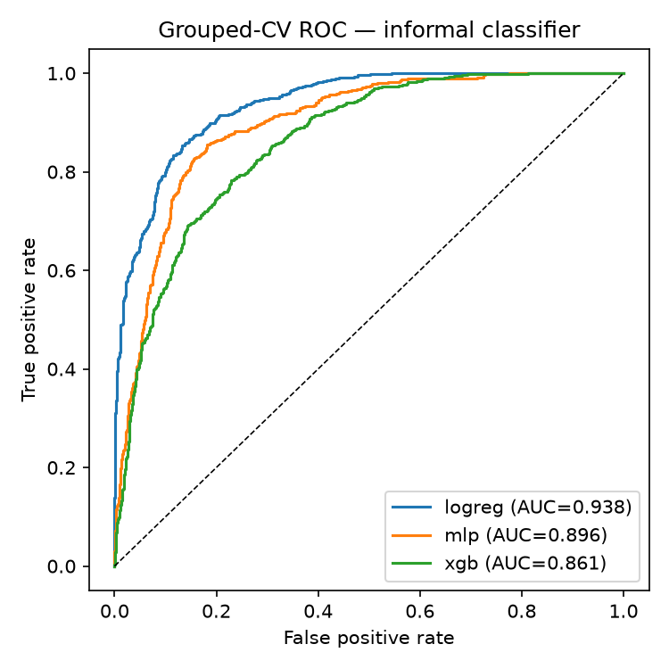
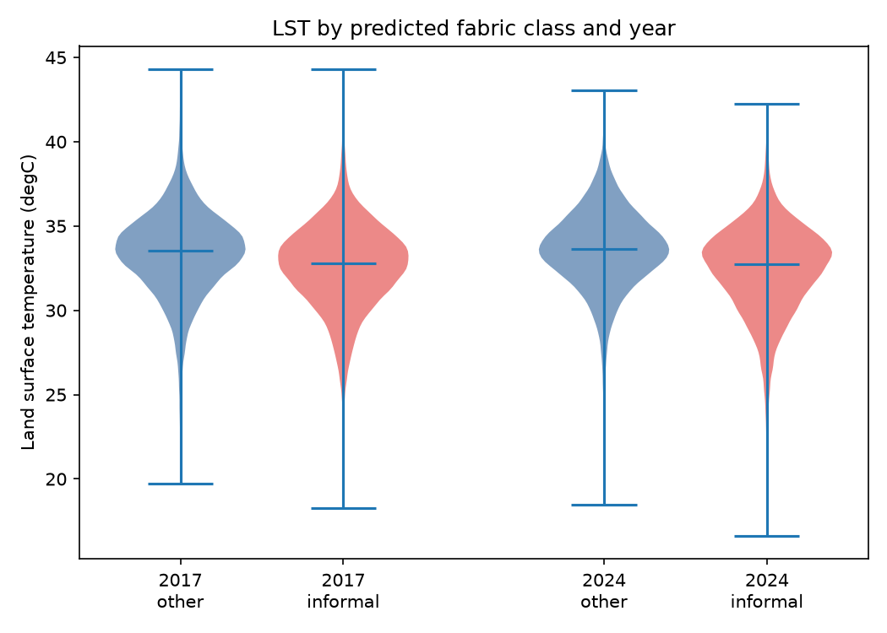
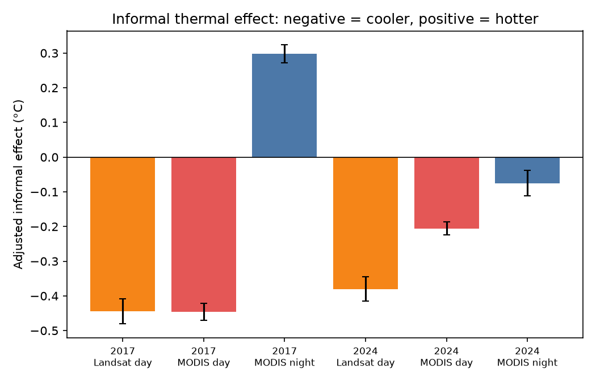

# A Satellite AI Model Maps Addis Ababa's Informal Settlements — and Finds a Heat Penalty Hidden Until Nightfall (2017–2024)

**Author:** Nahom Azmach
**Status:** Draft (70 hand-digitized labels; daytime + nighttime thermal analysis)

---

> **Key terms**
> - **Informal settlement:** densely built, unplanned housing — in Addis, typically small corrugated-metal-roofed dwellings on narrow, irregular streets ("slum" fabric), as opposed to planned apartments, villas, and industrial areas ("formal").
> - **Satellite embedding / foundation model:** an AI model trained on enormous amounts of imagery that turns each patch of ground into a list of numbers summarizing what's there. Just as a language model turns a sentence into numbers that capture its meaning, **AlphaEarth** turns every 10-metre patch of Earth into **64 numbers**. You don't hand-code what to look for — the model already learned general visual features.
> - **LST (land-surface temperature):** how hot the physical surface (roofs, roads, soil) is, read by a thermal satellite. *Not* the same as the air temperature a person feels.
> - **NDVI:** a standard "greenness" score from satellite bands; high = lush vegetation, low = bare or built-up.
> - **Landsat vs MODIS:** two thermal satellites. **Landsat** is sharp (30 m) but only passes over in mid-morning. **MODIS** is coarse (1 km) but passes several times a day — including ~1:30 am — so it can measure **night**.
> - **Adjusted effect:** a temperature difference between the two fabric types *after* using regression to statistically remove the influence of elevation and greenery, so what's left is attributable to the fabric itself.

## Abstract

Every recent study of Addis Ababa's urban heat relies on hand-crafted formulas applied to satellite bands (indices like NDVI/NDBI) plus standard regression, and none is framed around fairness to informal settlements. I take a different approach: I let an AI **satellite foundation model** (AlphaEarth) describe the ground, train a simple classifier on its output to tell informal from formal fabric, and then compare the two on temperature. Trained once on 2024 labels and applied to both 2017 and 2024, the classifier separates the two fabrics well (**cross-validated AUC 0.938** — see §6.1) and maps clear settlement expansion at the city's edges. Surprisingly, by **day** informal fabric is **not** hotter — after accounting for elevation and greenery it is slightly *cooler* (−0.41 °C in 2017, −0.38 °C in 2024). But when I extend the analysis to **night** (using MODIS), the picture inverts: in 2017 informal fabric is significantly *hotter* after dark (+0.30 °C per pixel; **+1.13 °C** in a cleaner "pure-cell" test, p ≈ 10⁻¹¹), and the nighttime penalty concentrates in the **established dense core** (+0.34 °C) rather than the newly-expanded fringe. The daytime null was an artifact of *when* the satellite looks: **daytime surface temperature hides a heat penalty that is real at night**, when dense fabric releases stored heat and residents cannot cool down. The AI classifier is a clear step up from index-based mapping; the day-vs-night contrast is the substantive contribution.

## 1. Introduction

Urban heat is a fairness problem: the people least able to adapt often live where it is hottest. Addis Ababa is growing fast, and its informal settlements are spreading into the peri-urban fringe (the edge where city meets countryside). Recent studies measure the city's "urban heat island," but they stop at index-based regression and none isolates an informal-settlement effect or asks whether the gap is widening.

This project asks: **can an AI satellite model detect informal fabric and any linked heat signal — without hand-crafted indices — and track how it changes as settlements grow?** The contributions are:

1. The first use of a satellite foundation model (AlphaEarth) to map Addis Ababa's urban fabric.
2. A confounder-adjusted estimate of the informal-vs-formal temperature difference, using a *train-once/apply-twice* design (below) for an honest 2017→2024 comparison.
3. A **daytime-vs-nighttime** comparison showing the heat penalty is invisible by day but present at night — a concrete demonstration that *when* you measure decides whether you see the inequity at all.
4. A **core-vs-fringe** breakdown locating that nighttime penalty in the established settlement rather than the expanding frontier.

## 2. Related Work

Existing Addis heat studies use greenness/built-up indices with ordinary or geographically-weighted regression, or split results by building type. None uses learned AI representations or an explicit informal-settlement fairness frame. AlphaEarth Foundations (the model used here) introduces the annual 10 m, 64-number embeddings and shows that even *simple* classifiers on them match or beat purpose-built models. Machine-learning mapping of deprived areas in Accra, Lagos, and Nairobi, and a deprivation study of Addis, guide where informal fabric concentrates.

## 3. Data

| Layer | Source | Resolution | Role |
|---|---|---|---|
| Land description | AlphaEarth Satellite Embedding V1 Annual | 10 m, 64 numbers | Classifier input |
| Surface temp (day) | Landsat 8/9 surface temperature (dry-season median) | 30 m → 10 m grid | Outcome |
| Surface temp (day+night) | MODIS Terra+Aqua LST (dry-season median) | 1 km | Outcome (extension) |
| Greenness | Sentinel-2 NDVI (dry-season median) | 10 m | Control variable |
| Elevation | SRTM | 30 m | Control variable |
| Built-up mask | GHS-BUILT-S (2025) | 100 m | Defines the study area |
| RGB photo | Sentinel-2 (true colour) | 10 m | Visualization only |

**Study area.** The official city boundary (~542 km²) is tighter than the real built-up city and cuts off the peri-urban fringe — exactly where informal growth happens, and where 27% of my informal labels fell. So I define the study area as the official boundary **grown outward by 10 km, then trimmed to built-up land only** (using a global settlement layer). This keeps rural farmland from sneaking into the "formal" group and making it look artificially cool. Everything is composited over the **dry season** (Dec–Feb) to avoid rainy-season clouds. The result is ~420 km² of city (a 5008×4956-pixel grid at 10 m).

## 4. Labels

No ready-made map of Addis's informal settlements exists, so I hand-drew **70 polygons** (31 informal / 39 other) over high-resolution 2024 imagery, covering both the inner city and the fringe, guided by neighbourhoods the deprivation literature flags. I labelled only against 2024 imagery; the trained model is then applied *unchanged* to 2017 (see §5). Sixty-four polygons landed on valid built-up pixels. Crucially, when measuring accuracy I split **by polygon, not by pixel** — pixels from the same drawn shape look almost identical, so letting them appear in both training and testing would inflate the score.

## 5. Method

**Classifier.** A simple per-pixel model reads the 64 numbers for a pixel and predicts informal vs other. I compare three: a **linear** model (logistic regression), a small **neural network** (MLP), and **gradient-boosted trees** (XGBoost). Accuracy is measured with *polygon-grouped 5-fold cross-validation* — the data is split into five groups of whole polygons, and each group takes a turn being the held-out test set, so every polygon is predicted by a model that never saw it.

**Train once, apply twice.** I train on 2024 labels, then *freeze* the model and run it on both 2017 and 2024 imagery. Because the decision rule never changes, any difference between years reflects real change on the ground, not me labelling differently. Pixels that flip from "other" (2017) to "informal" (2024) form the **settlement-expansion map**.

**Statistics.** For each year I compare the two classes' temperatures with a Mann–Whitney U test (a rank-based test that doesn't assume a bell curve) and, more importantly, a regression `LST ~ class + NDVI + elevation`. The coefficient on `class` is the **adjusted effect**: the leftover temperature gap attributable to fabric type after removing greenery and elevation. A pooled model with a `class × year` term tests whether the gap changed over time, and I cross-check by comparing classes *within* narrow elevation bands.

**Nighttime extension.** I repeat the adjusted regression using MODIS **night** temperature (with MODIS **day** as a same-satellite control). Because MODIS pixels are ~1 km and informal patches are often smaller, one pixel can mix both fabrics; so I add (a) a **purity-restricted** test using only 1 km cells that are ≥70% one class, and (b) a **core-vs-fringe** split that labels pure-informal cells as established *core* (already informal in 2017) or *expansion* (informal only by 2024) and compares each to *other* cells.

## 6. Results

***Figure 1.** The three data views for 2024. Left: true-colour satellite photo. Centre: the AI classifier's map of fabric type (red = informal, grey = other). Right: daytime surface temperature. Only built-up land is analysed; white is outside the study area.*

### 6.1 Classification
The simple **linear** model wins — a known trait of these AI embeddings, where the useful information is already laid out so plainly that fancy models add little. (AUC, "Area Under the Curve", scores separation from 0.5 = coin-flip to 1.0 = perfect.)

| Model | CV AUC | CV F1 | Per-polygon AUC |
|---|---|---|---|
| **Logistic regression (linear)** | **0.938** | 0.853 | 0.935 |
| MLP (neural net) | 0.896 | 0.831 | 0.912 |
| XGBoost (trees) | 0.861 | 0.770 | 0.856 |

***Figure 2.** How well each model separates informal from other. Higher/closer to the top-left is better. The linear model (AUC 0.938) leads.*

The share of built-up land predicted informal rises from **31% (2017) to 42% (2024)**, and the change map marks **18% of the city as new (other→informal) growth**, mostly at the fringe — the pattern we'd expect from Addis's rapid expansion.

***Figure 3.** Where the city changed. Red = new informal growth (2017→2024); dark red = informal in both years (established core). Growth clusters at the peri-urban edges.*

### 6.2 The daytime result
Against expectation, by day informal fabric is **cooler**, not hotter:

| Year | Raw temp gap | Adjusted (greenery + elevation) | 95% CI | Effect size |
|---|---|---|---|---|
| 2017 | −0.76 °C | **−0.405 °C** | [−0.433, −0.376] | 0.18 |
| 2024 | −0.90 °C | **−0.379 °C** | [−0.406, −0.352] | 0.25 |

The difference is statistically certain but *small* (with ~100,000 pixels, even tiny gaps register; the "95% CI" is the range the true value almost certainly lies in). It survives every control I tried — including comparing classes only within the same elevation band (−0.30 °C) — so it's not just an elevation artifact.

***Figure 4.** The daytime result. Each shape shows the spread of temperatures for a class (red = informal, blue = other). Informal sits slightly *lower* — the opposite of a heat penalty. §7 shows this reverses at night.*

## 7. Extension: does the penalty appear at night?

The daytime null has an obvious suspect — **time of day**. Heat inequity is largely a *nighttime* problem: dense fabric soaks up sun all day and radiates it back after dark, exactly when people without air-conditioning are trying to sleep. But Landsat only passes over at ~10:30 am. So I re-ran the analysis on MODIS **night** temperature, with MODIS **day** as a same-satellite control.

**The daytime cooling reverses at night.** Landsat-day and MODIS-day agree almost exactly (both −0.45 °C in 2017), which rules out a "different satellite" excuse — and then the *same* MODIS sensor turns positive at night:

| Year | Landsat day | MODIS day | MODIS **night** | day→night shift |
|---|---|---|---|---|
| 2017 | −0.445 °C | −0.446 °C | **+0.298 °C** | **+0.74 °C** |
| 2024 | −0.380 °C | −0.205 °C | **−0.075 °C** | +0.31 °C |

In both years the informal effect moves *toward hotter* from day to night. In 2017 it crosses zero into a real nighttime **heat penalty** (+0.30 °C).

***Figure 5.** The key result. Bars below zero (orange/red) mean informal is cooler; above zero (blue) means hotter. Daytime satellites agree informal is cooler — but the same MODIS sensor at night flips positive in 2017, the fingerprint of heat trapped overnight.*

**The "pure-cell" test sharpens 2017.** Using only 1 km cells that are ≥70% one fabric (so we compare clean examples, not mixtures), informal cells are **+1.13 °C hotter at night** than other cells in 2017 (95% CI [+0.80, +1.46], p ≈ 2×10⁻¹¹; 97 informal vs 947 other cells). The 2024 pure-cell contrast is flat — which the next test explains.

**Why 2024 washes out: core vs fringe.** Splitting the 2024 pure-informal cells by whether they were *already* informal in 2017 (established **core**) or appeared only by 2024 (**expansion**), and comparing each to other cells on night temperature:

| Group | cells | adjusted night gap vs other | 95% CI | p |
|---|---|---|---|---|
| **Core (established)** | 164 | **+0.34 °C** | [−0.01, +0.69] | 0.059 |
| Expansion (new fringe) | 60 | −0.14 °C | [−0.67, +0.39] | 0.60 |

***Figure 6.** The 2024 nighttime heat gap for established core informal vs the newly-built fringe. The core trends hotter (+0.34 °C, marginal at p = 0.06); the new fringe shows nothing — consistent with newer, lower-density housing not yet packed tightly enough to trap heat overnight.*

The core effect is marginal (p = 0.06, only 164 cells), so I don't overstate it — but its *direction* is clear, and mixing in the penalty-free expansion cells is exactly what flattens the 2024 average. Together — a strong, significant 2017 night penalty and a core-concentrated 2024 signal — the nighttime evidence supports the reading that daytime satellites simply couldn't see the heat burden.

## 8. Discussion

The story is a twist with a resolution. By day, a strong classifier finds **no heat penalty** — informal fabric even reads slightly cooler. But that's about the *measurement*, not the settlements. At 10:30 am, dense low-rise informal fabric with narrow shaded alleys stays cool, while the "formal" side is full of hot open surfaces — big metal roofs, wide roads, bare lots. Switch to **night**, and the sign flips: informal fabric runs hotter, most clearly in the established dense core where decades of packed building have built up heat-holding mass. Daytime surface temperature is the wrong instrument for a problem that is fundamentally nocturnal — the penalty was there all along, hidden by the hour of the overpass. That it concentrates in the core rather than the fringe is itself telling: the heat burden is a property of mature, consolidated informal fabric, and the frontier may be growing into it.

## 9. Limitations

- **Surface ≠ air temperature.** Both satellites measure surface heat, not the air people breathe. The night result is a better proxy for lived experience, but still a proxy.
- **MODIS is coarse.** At 1 km the night analysis mixes fabric types; the pure-cell and core/fringe tests reduce but can't remove this, and the 2024 core effect is marginal (p = 0.06).
- **Resolution ceiling.** 30 m (day) / 1 km (night) temperature vs 10 m fabric — no claim about individual buildings.
- **Hand-drawn labels.** 70 polygons, my own judgement, no field survey; pushing toward 100–150 would tighten the estimates.
- **Association, not proof.** These are correlations after controls, not a demonstrated mechanism.
- **One city, one season.** Dry-season Addis only; results won't automatically transfer elsewhere.

## 10. Conclusion

An AI satellite model maps Addis Ababa's informal fabric well (94% AUC) and cleanly tracks its growth — a real advance over hand-crafted indices, and one that reaches the fringe official-boundary studies miss. The thermal lesson is the payoff: by day, informal fabric shows *no* heat penalty and even looks cooler, but that is an artifact of the mid-morning overpass. At **night** the penalty appears — informal fabric runs up to ~1 °C hotter, concentrated in the established dense core — exactly where heat harms people who can't cool down after dark. The takeaway generalizes well beyond Addis: **whether you detect urban-heat inequity depends on the time of day you measure it**, and daytime surface temperature can hide a penalty that is plainly there at night. Measuring at night — and eventually air temperature — is the necessary next step.

---

### Reproducibility
Code in `scripts/01`–`10`; run order in `README.md`. Metrics in `models/metrics.json`; daytime statistics in `results/statistics.json`; nighttime results in `results/nighttime.json` and `results/core_vs_fringe.json`; figures in `figures/`.
